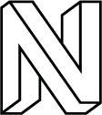

# Neos Brand Assets

**IMPORTANT: The spacing between the N and the text in the logos changed. Make sure to update logos that are already in use!**

https://neos.io

This repository contains the Branding Assets of the Neos Project, i.e.

* First read [The Brand Guide](https://github.com/neos/brand/blob/master/guides/neos_brand.pdf)
* Different assets such as logo variants.

If you have any questions on how to use them, we'd [love to hear from you](https://www.neos.io/docs-and-support/support.html)!

## Neos Logo

### Primary Logo

[SVG](logos/Neos/neos_primary.svg)
[EPS](logos/Neos/neos_primary.eps)
[PNG](logos/Neos/neos_primary.png) 
[PNG@2x](logos/Neos/neos_primary@2x.png) 

### Logo Variants

#### Negative Logo for light backgrounds

[SVG](logos/Neos/neos_negative_light.svg)
[EPS](logos/Neos/neos_negative_light.eps)
[PNG](logos/Neos/neos_negative_light.png) 
[PNG@2x](logos/Neos/neos_negative_light@2x.png) 

#### Negative Logo for dark backgrounds

[SVG](logos/Neos/neos_negative_dark.svg)
[EPS](logos/Neos/neos_negative_dark.eps)
[PNG](logos/Neos/neos_negative_dark.png) 
[PNG@2x](logos/Neos/neos_negative_dark@2x.png) 

#### Outline Logo

[SVG](logos/Neos/neos_monochrome.svg)
[EPS](logos/Neos/neos_monochrome.eps)
[PNG](logos/Neos/neos_monochrome.png) 
[PNG@2x](logos/Neos/neos_monochrome@2x.png) 

## Flow Logo

### Primary Logo

[SVG](logos/Flow/flow_primary.svg)
[EPS](logos/Flow/flow_primary.eps)
[PNG](logos/Flow/flow_primary.png) 
[PNG@2x](logos/Flow/flow_primary@2x.png)

### Logo Variants

#### Negative Logo for light backgrounds

[SVG](logos/Flow/flow_negative_light.svg)
[EPS](logos/Flow/flow_negative_light.eps)
[PNG](logos/Flow/flow_negative_light.png) 
[PNG@2x](logos/Flow/flow_negative_light@2x.png) 

#### Negative Logo for dark backgrounds

[SVG](logos/Flow/flow_negative_dark.svg)
[EPS](logos/Flow/flow_negative_dark.eps)
[PNG](logos/Flow/flow_negative_dark.png) 
[PNG@2x](logos/Flow/flow_negative_dark@2x.png) 

#### Outline Logo

[SVG](logos/Flow/flow_monochrome.svg)
[EPS](logos/Flow/flow_monochrome.eps)
[PNG](logos/Flow/flow_monochrome.png) 
[PNG@2x](logos/Flow/flow_monochrome@2x.png) 

## Single N Avatar

### Primary Logo

[SVG](logos/Avatars/neos_avatar_primary.svg)
[EPS](logos/Avatars/neos_avatar_primary.eps)
[PNG](logos/Avatars/neos_avatar_primary.png) 
[PNG@2x](logos/Avatars/neos_avatar_primary@2x.png)

### Logo Variants

#### Negative Logo for light backgrounds

[SVG](logos/Avatars/neos_avatar_negative_light.svg)
[EPS](logos/Avatars/neos_avatar_negative_light.eps)
[PNG](logos/Avatars/neos_avatar_negative_light.png) 
[PNG@2x](logos/Avatars/neos_avatar_negative_light@2x.png) 

#### Negative Logo for dark backgrounds

[SVG](logos/Avatars/neos_avatar_negative_dark.svg)
[EPS](logos/Avatars/neos_avatar_negative_dark.eps)
[PNG](logos/Avatars/neos_avatar_negative_dark.png) 
[PNG@2x](logos/Avatars/neos_avatar_negative_dark@2x.png) 

#### Outline Logo

[SVG](logos/Avatars/neos_avatar_monochrome.svg)
[EPS](logos/Avatars/neos_avatar_monochrome.eps)
[PNG](logos/Avatars/neos_avatar_monochrome.png) 
[PNG@2x](logos/Avatars/neos_avatar_monochrome@2x.png) 