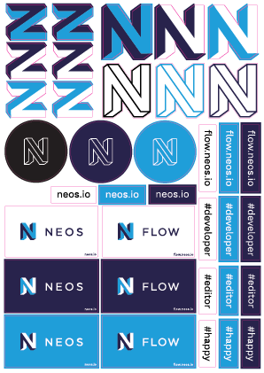

# Stickers

## MacBook Lid Stickers

#### 60x60mm (for old MacBooks) ####

[2017-lidStickers-macbook-60x60mm.svg](2017-lidStickers-macbook-60x60mm.svg)

#### 48x48mm (for new MacBooks with touchbar) ####

[2017-lidStickers-macbook-48x48mm.svg](2017-lidStickers-macbook-48x48mm.svg)

#### Colors

MP schwarz matt, MP weiß matt, Oracal 631 Lichtblau matt, Oracal 631 Dunkelblau matt

### How to print

Actually this is not printed but cut out out of a foil with a plotter.
Make sure to use a foil that is opaque.

IMPORTANT: for old MacBooks the stickers have to be 60x60mm to match the apple logo on the lid. For MacBooks with a touchbar the the stickers need to be plotted 48x48mm.

Make sure the sticker is produced with a transferfoil, to ensure an easy application to your lid ;)

### Where to print

#### Germany 
[http://folienplot-aufkleber.de/produkt/folienplot-aufkleber/](http://folienplot-aufkleber.de/produkt/folienplot-aufkleber/), more information -> [2017-lidStickers-print-germany.png](2017-lidStickers-print-germany.png)

### How to put on

Clean you lid. Remove dirt, grease and coffee stains.

IMPORTANT: Make sure the N is upright when the lid is open. Please double-check with the logofiles here -> https://github.com/neos/brand

Use a plastic card to apply the logo to the lid. Start with on edge and slowly advance to the opposite edge. Make sure to swipe out all air bubbles.

## Sticker Sheet

[2017-stickerSheet.pdf](2017-stickerSheet.pdf)

### How to print

Should be printed on a foil with a mat finish without the magenta line and then cut along the magenta line. Afterwards the space not used for the stickers should be removed. The outer format is A4.

### Where to print

#### Germany
[http://folienplot-aufkleber.de/produkt/folienplot-aufkleber/](http://folienplot-aufkleber.de/produkt/folienplot-aufkleber/), more information -> [2017-stickerSheet-print-germany.png](2017-stickerSheet-print-germany.png)